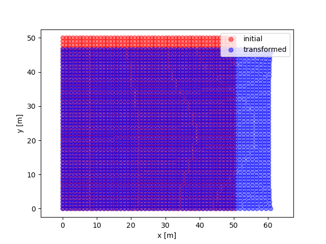

# Pythonで作る2次元変位解析FEM

Pythonを用いた2次元弾性体に対する変位解析のデモプログラムです。
コードの解説については[こちらのサイト](https://kulabo.github.io/2D_FEM_Python/python-2d-fem-01.html)にアップロードしましたのでご確認ください。


## Installation

```
git clone https://github.com/kulabo/2D_FEM_Python.git
cd 2D_FEM_Python
pip install -r requirements.txt
```

`.ipynb`ファイルの閲覧には別途Jupyterが必要になりますので、その場合は
```
pip install jupyter
```
も実行してください。

## Usage

```
python fem.py
```

材料定数などを変更する場合、main関数の中に定義されている値を編集してください。


Fig.1 解析結果の一例

変形前の物体の各節点が赤色、変形後の物体の各節点が青色で表示されます。この図では、物体の左側面を完全固定、右側面に右向きに荷重をかけています。この設定はコード中のデフォルト設定です。結果の画像はmesh_dataというディレクトリに保存されます。